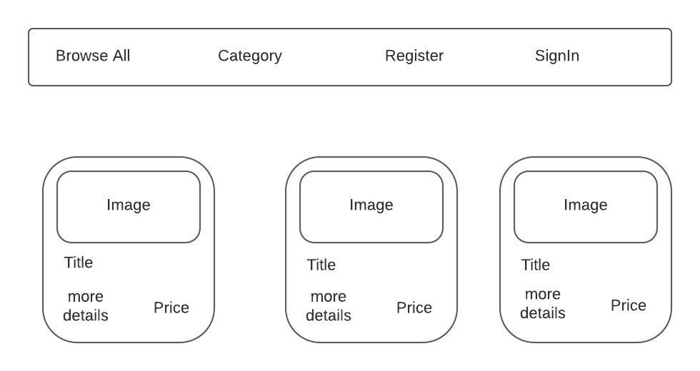
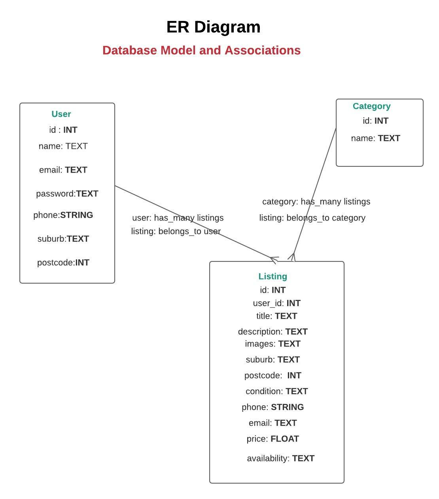
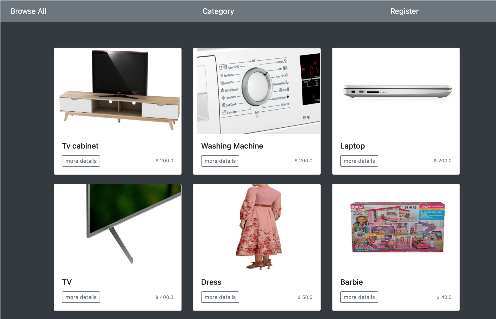

# MarketPlace

#### Please click [here](https://priyankapatel-project1.herokuapp.com) to take an advantage online Marketplace.

## Introduction

An online marketplace is a type of e-commerce website where product or service information is provided by multiple third parties. Online marketplaces are the primary type of multichannel ecommerce and can be a way to streamline the production process.

### Description about an Markerplace application

* ### Purpose:

  Online shopping for community, where people can not just buy products but also sell the  products.

* ### Functionality and Features:

  ##### User authentication
   Without being logged in, users are able to see the index of all the listings and summary information of those listings, but won’t be able to use any of the site functionality.

  ##### Logging in and signing up
  Users will then be able to create their own listings. In the navigation bar, users can see which account they’re logged in as and a specific view of all their own listings.

  ##### Listings
  Once the listing has been created, it can only be edited and deleted by the user who created the listing.

* ##### Wireframe:

  

* ##### Database Model:
  

* ##### What can you do as a User?:
  * You can log in or sign up, as well as log out.
  * You can view the index of all listings.
  * You can create your own listings.
  * You can edit and delete any of the information from your own listing.
  * You can see all listings available on Marketplace with further details, including a map with location information.
  * You can see a complete list of your own listings.

* ##### Technology Used

  * Ruby on Rails
  * PostgreSQL
  * Ruby
  * HTML
  * CSS
  * Heroku
  * Twilio
  * Bootstrap
  * Open street map
  * Gems: Bootstrap, Cloudinary, twilio-ruby, open_street_map

### Details of third party services used:
  * ##### Heroku:
    Fast, all-in-one web hosting service.

  * ##### Open street Map:
    Displays the location on a map embedded on the site.
  * ##### Bootstrap:
   Rails Gem to implement simple and standardised styling.

  * ##### Twilio:
   Cloud communication platform that provides sms service.

  * ##### Cloudinary:
    Cloudinary is an end-to-end image- and video-management solution for websites and mobile apps, covering everything from image and video uploads, storage, manipulations, optimizations to delivery.

    ### Application Overview
    
